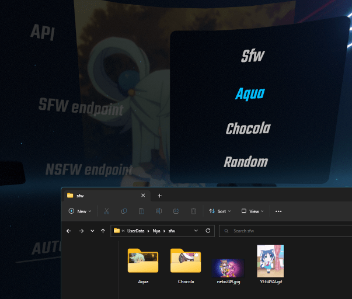

# Nya 

A BeatSaber mod for displaying nya-tastic images from various web APIs

## Usage

### Accessing Nya's Settings

Nya's settings can be accessed from the ⚙️ button, pressing this will bring up a modal for common settings, such as the currently selected API. Further settings can be accessed from the ➕ tab.

Alternatively settings can also be accessed from BSML's Mod Settings view.

### Resetting Nya's Floating Screen Position

Nya features a floating screen, allowing Nya to be accessed outside of the gameplay setup panel. In the event that this floating screen gets stuck somewhere inaccessible it's position can be reset from Nya's settings.

### Supported Image Sources

**Note: I don't own any of these sources so I can't guarantee the images will always be appropriate**

- [Waifu.Pics](https://waifu.pics/)
- [Nekos.Life](https://nekos.life/)
- [BocchiTheAPI](https://bocchi.pixelboom.dev/)
- [Local Files](#local-files)

### Local Files

Nya can load images which are saved within `Beat Saber\UserData\Nya\sfw` and `Beat Saber\UserData\Nya\nsfw`. Additionally Nya will treat any subfolders in these directories as 'endpoints', meaning you can switch from local files saved in different folders.

Nya will only load images with the file type of `png`, `jpg`, `jpeg`, `gif` or `apng`.

Images which are downloaded via Nya will be saved in the sfw / nsfw folders.

## Installation

[Install](https://bsmg.wiki/pc-modding.html#install-mods) the latest version of [Nya](https://github.com/Sirspam/Nya/releases/latest) and the dependencies listed below.

### Dependencies

- [SiraUtil](https://github.com/Auros/SiraUtil) _- Available in ModAssistant_
- [BeatSaberMarkupLanguage](https://github.com/monkeymanboy/BeatSaberMarkupLanguage) _- Available in ModAssistant_

## Contribution

Feel free to point out any suggestions or improvements by submitting a PR or contacting me on Discord ([Sirspam#7765](https://discordapp.com/users/232574143818760192)).

### Adding APIs

Nya fetches a list of APIs to use from a JSON file, the URL to this JSON is stored as the field `ImageSourcesJsonLink` in [Plugin.cs](https://github.com/Sirspam/Nya/blob/main/Nya/Plugin.cs).

For contributing APIs to this repo, please modify [ImagesSources.json](https://github.com/Sirspam/Nya/blob/dev/ImageSources.json) and create a pull request with your changes.

For personal use, please feel free to change `ImageSourcesJsonLink` to point to your JSON file.
